# Architecture

This document describes the internal architecture of STASHCAST, particularly the service layer that provides shared functionality between the CLI and web app.

## Overview

STASHCAST is organized into two main layers:

1. **Service Layer** (`service/`) - Framework-agnostic media processing logic
2. **Web App Layer** (`media/`) - Django-specific models, views, and tasks

This separation allows the core media processing logic to be reused by both the CLI tool (`manage.py transcode`) and the web application.


## Directory Structure

```
stashcast/
├── service/                    # Service layer (framework-agnostic)
│   ├── constants.py           # Shared constants (media extensions)
│   ├── strategy.py            # Download strategy detection
│   ├── resolve.py             # Metadata extraction and type resolution
│   ├── download.py            # Download implementations (HTTP, yt-dlp)
│   ├── process.py             # Media processing (transcode, metadata)
│   ├── config.py              # Configuration adapter
│   ├── transcode_service.py   # Main transcode orchestration
│   └── tests/                 # Service layer tests (121 tests)
│
├── media/                      # Web app layer (Django-specific)
│   ├── models.py              # MediaItem model
│   ├── views.py               # HTTP endpoints (/stash/, /items/)
│   ├── feeds.py               # Podcast feed generation
│   ├── tasks.py               # Huey background tasks
│   ├── admin.py               # Django admin interface
│   └── tests/                 # Web app tests (42 tests)
│
└── stashcast/                  # Django project settings
    └── settings.py
```

## Service Layer Components

### `service/constants.py`

Centralized media format definitions:

- `MEDIA_EXTENSIONS` - All supported formats (`.mp3`, `.mp4`, etc.)
- `AUDIO_EXTENSIONS` - Audio-only formats
- `VIDEO_EXTENSIONS` - Video-only formats

**Used by**: `strategy.py`, `resolve.py`

### `service/strategy.py`

Download strategy detection:

```python
def choose_download_strategy(url) -> str:
    """Returns 'file', 'direct', or 'ytdlp'"""
```

Determines whether to:
- Copy a local file (`file`)
- Download via HTTP (`direct`)
- Use yt-dlp for extraction (`ytdlp`)

**Used by**: CLI transcode command, web app tasks

### `service/resolve.py`

Metadata extraction and media type resolution:

```python
def prefetch(url, strategy, logger=None) -> PrefetchResult:
    """Extract metadata without downloading"""

def resolve_media_type(requested_type, prefetch_result) -> str:
    """Determine 'audio' or 'video' from metadata"""

def get_media_type_from_extension(extension) -> str:
    """Determine media type from file extension"""
```

**Used by**: CLI transcode command, web app prefetch tasks

### `service/download.py`

Download implementations:

```python
def download_file(file_path, out_path, logger=None) -> DownloadedFileInfo:
    """Copy local file"""

def download_direct(url, out_path, logger=None) -> DownloadedFileInfo:
    """Download via HTTP"""

def download_ytdlp(url, resolved_type, temp_dir, ytdlp_extra_args='', logger=None) -> DownloadedFileInfo:
    """Download using yt-dlp"""
```

All return `DownloadedFileInfo` dataclass with paths to content, thumbnail, and subtitles.

**Used by**: CLI transcode command

### `service/process.py`

Media processing (transcoding, metadata embedding):

```python
def needs_transcode(file_path, resolved_type) -> bool:
    """Check if file needs transcoding"""

def transcode_to_playable(input_path, resolved_type, output_path,
                          ffmpeg_extra_args='', metadata=None, logger=None) -> ProcessedFileInfo:
    """Transcode media to compatible format with metadata"""

def add_metadata_without_transcode(input_path, output_path,
                                   metadata=None, logger=None) -> Path:
    """Add metadata without re-encoding (stream copy)"""

def process_thumbnail(thumbnail_path, output_path, logger=None) -> Path:
    """Convert thumbnail to WebP"""

def process_subtitle(subtitle_path, output_path, logger=None) -> Path:
    """Convert subtitle to VTT"""
```

**Key features**:
- Preserves existing metadata from source files
- Only adds metadata if source doesn't already have it
- Falls back to simple file copy if ffmpeg fails
- Used by both CLI and web app for consistent processing

**Used by**: CLI transcode command, web app processing tasks

### `service/config.py`

Configuration adapter that centralizes access to Django settings:

```python
def get_ytdlp_args_for_type(media_type) -> str:
    """Get yt-dlp arguments from settings"""

def get_ffmpeg_args_for_type(media_type) -> str:
    """Get ffmpeg arguments from settings"""

def parse_ytdlp_extra_args(args_string, base_opts) -> dict:
    """Parse yt-dlp CLI args into options dict"""

def get_target_audio_format() -> str:
    """Returns '.m4a'"""

def get_target_video_format() -> str:
    """Returns '.mp4'"""
```

**Used by**: All service modules that need configuration

### `service/transcode_service.py`

Main orchestration for the CLI transcode command:

```python
def transcode_url(url, outdir, requested_type='auto',
                  dry_run=False, verbose=False) -> TranscodeResult:
    """Complete pipeline: detect → prefetch → download → process"""
```

Coordinates all service modules to:
1. Detect download strategy
2. Prefetch metadata
3. Resolve media type
4. Download media
5. Transcode if needed
6. Process thumbnails/subtitles
7. Embed metadata

**Used by**: CLI transcode command

## Web App Layer

### `media/tasks.py`

Huey background tasks for the web application:

```python
@db_task()
def process_media(guid):
    """Main processing task"""
    # 1. PREFETCHING
    # 2. DOWNLOADING
    # 3. PROCESSING - uses service.process functions
    # 4. READY

@db_task()
def generate_summary(guid):
    """Generate summary from subtitles"""
```

**Key refactorings**:
- Uses `choose_download_strategy()` instead of duplicate logic
- Uses `get_media_type_from_extension()` for type resolution
- Uses `add_metadata_without_transcode()` for metadata embedding
- Uses `process_thumbnail()` and `process_subtitle()` for asset processing

### `media/models.py`

Django model representing a media item with all metadata and file paths.

### `media/views.py`

HTTP endpoints:
- `/stash/` - API endpoint to queue downloads
- `/items/<guid>/` - Episode detail pages

### `media/feeds.py`

Podcast feed generation using Django's syndication framework.

### `media/admin.py`

Django admin interface with custom actions for re-fetching and regenerating summaries.

## Data Flow

### CLI Transcode Command

```mermaid
sequenceDiagram
    actor User
    participant CLI as manage.py transcode
    participant TS as transcode_service
    participant Strat as strategy.py
    participant Resolve as resolve.py
    participant Download as download.py
    participant Process as process.py
    participant Disk as File System

    User->>CLI: python manage.py transcode <url>
    CLI->>TS: transcode_url(url, outdir, type)
    TS->>Strat: choose_download_strategy(url)
    Strat-->>TS: 'direct' | 'ytdlp' | 'file'
    TS->>Resolve: prefetch(url, strategy)
    Resolve-->>TS: PrefetchResult (title, metadata)
    TS->>Resolve: resolve_media_type(type, result)
    Resolve-->>TS: 'audio' | 'video'

    alt yt-dlp download
        TS->>Download: download_ytdlp(url, type)
        Download-->>TS: DownloadedFileInfo
    else direct download
        TS->>Download: download_direct(url)
        Download-->>TS: DownloadedFileInfo
    else local file
        TS->>Download: download_file(path)
        Download-->>TS: DownloadedFileInfo
    end

    alt needs transcode
        TS->>Process: transcode_to_playable(input, type, output, metadata)
        Process-->>TS: ProcessedFileInfo
    else no transcode needed
        TS->>Process: add_metadata_without_transcode(input, output, metadata)
        Process-->>TS: output_path
    end

    opt has thumbnail
        TS->>Process: process_thumbnail(thumb, output)
        Process-->>TS: thumbnail_path
    end

    opt has subtitles
        TS->>Process: process_subtitle(sub, output)
        Process-->>TS: subtitle_path
    end

    TS->>Disk: Write output files
    TS-->>CLI: TranscodeResult
    CLI-->>User: Success (file paths)
```



### Web App Stash Endpoint


## Design Principles

### 1. Single Source of Truth

- **Constants**: All media extensions in `service/constants.py`
- **Strategy**: URL detection logic in `service/strategy.py`
- **Processing**: Metadata/transcode logic in `service/process.py`

### 2. Separation of Concerns

- **Service layer**: Pure Python, framework-agnostic, returns dataclasses
- **Web layer**: Django-specific, updates models, manages task queue

### 3. Consistent Behavior

Both CLI and web app:
- Use same download logic
- Use same metadata embedding
- Use same thumbnail/subtitle processing
- Get same configuration from Django settings

### 4. Testability

- **Service layer**: 121 tests, no Django dependencies
- **Web layer**: 42 tests for Django-specific features
- Total: 163 tests, all passing

## Configuration

All configuration is centralized in Django settings (via environment variables):

```python
# Required
STASHCAST_AUDIO_DIR = '/path/to/audio'
STASHCAST_VIDEO_DIR = '/path/to/video'
STASHCAST_API_KEY = 'secret'

# Optional
STASHCAST_DEFAULT_YTDLP_ARGS_AUDIO = '--format bestaudio'
STASHCAST_DEFAULT_YTDLP_ARGS_VIDEO = '--format "bv*[height<=720]"'
STASHCAST_DEFAULT_FFMPEG_ARGS_AUDIO = '-c:a aac -b:a 128k'
STASHCAST_DEFAULT_FFMPEG_ARGS_VIDEO = '-c:v libx264 -preset medium'
```

Both CLI and web app read configuration through `service/config.py`.

## Metadata Handling

### Metadata Preservation

The service layer preserves existing metadata from source files:

1. Extract existing metadata with `get_existing_metadata()`
2. Only add new metadata if source doesn't have it
3. Use `-map_metadata 0` to copy all existing tags
4. Prefer source metadata over yt-dlp metadata

This ensures:
- Original artist/album info is preserved
- Only missing metadata is filled in
- No metadata is lost during processing


### Metadata Embedding Methods

**With transcoding** (`transcode_to_playable`):
- Re-encodes media to target format
- Embeds metadata during transcode
- Used when format conversion needed

**Without transcoding** (`add_metadata_without_transcode`):
- Uses `ffmpeg -c copy` for stream copy
- No quality loss
- Faster than transcoding
- Used when format is already compatible

## Future Enhancements

The architecture is designed to support:

1. **Alternative backends**: Service layer could be adapted for cloud storage
2. **Batch processing**: Service functions are stateless and reusable
3. **Alternative frontends**: Service layer could power API, CLI, or GUI
4. **ML-based summaries**: Service layer has hooks for future transcription/summarization

## Development

### Running Tests

```bash
# All tests
python manage.py test

# Service layer only
python manage.py test service.tests

# Web app only
python manage.py test media.tests

# Parallel execution
python manage.py test --parallel
```

### Adding New Features

**For features used by both CLI and web app:**
1. Add to appropriate service module
2. Add tests to `service/tests/`
3. Update both CLI command and web tasks to use it

**For web-only features:**
1. Add to `media/` directory
2. Add tests to `media/tests/`
3. No service layer changes needed

## Summary

The service layer refactoring eliminated code duplication and created a clean separation between:

- **What to do** (service layer - media processing logic)
- **When to do it** (web layer - task scheduling, user interaction)

This makes the codebase easier to maintain, test, and extend.
