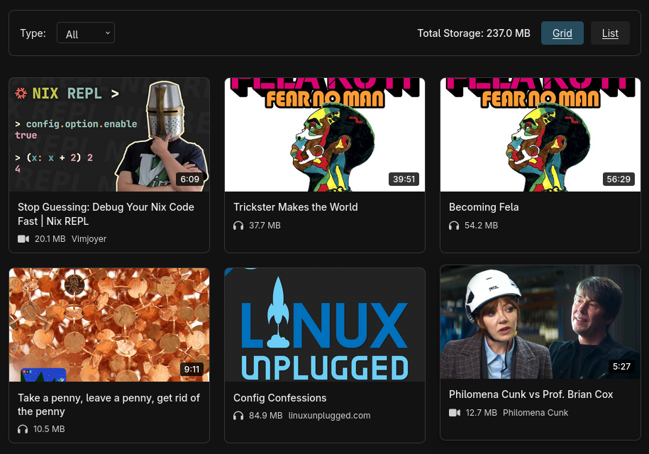

<p align="center">
  
</p>

<p align="center">
  <a href="https://github.com/jonocodes/stashcast/actions/workflows/tests.yml">
    
  </a>
  <a href="http://makeapullrequest.com">
    
  </a>
  <a href="https://www.gnu.org/licenses/gpl-3.0">
    
  </a>
</p>

StashCast is an application for downloading online media (audio/video) for offline consumption and exposing it via podcast feeds, so you can watch it later. It runs as a single user Django web app.

## Demo

Demo instance running here:
https://demo.stashcast.dgt.is/

The user is 'demo' and the password is 'demo' spelled backwards. The demo user can not add/remove/update content.


## Motivation

I created this since friends and family often send me links to listen to a single episode of a podcast via Apple Podcasts, or a single lecture on youtube. I don't want to subscribe to the show to listen to a single eposide, but I do want to listen to it - later.

## Features

- Download media from any URL supported by yt-dlp, direct media URLs, HTML with embedded media, playlists, multiple embeds
- **Multi-language support** - UI and video subtitles in your preferred language (see [i18n docs](docs/INTERNATIONALIZATION.md))
- Async background processing via task queue
- Automatic media type detection (audio/video)
- Podcast feed generation (RSS/Atom) for audio and video
- Optional transcoding via ffmpeg
- Extractive summarization from subtitles
- Bookmarklet for one-click media ingestion
- Admin interface for managing downloads
- Django commands for management via CLI instead of web

### Non-features

- Downloading non audio/video content. For that you may check out our sister project [Savr](https://github.com/jonocodes/savr).
- Only downloading youtube videos. yt-dlp supports thousands of of different websites.
- Subscribing to playlists. For that you could checkout [TubeSync](https://github.com/meeb/tubesync) or [Podsync](https://github.com/mxpv/podsync).
- Long term archiving. While this may work for you there are other tools perhaps more suited for this. See [ArchiveBox](https://github.com/ArchiveBox/ArchiveBox) or [Tube Archivist](https://github.com/tubearchivist/tubearchivist)
- A playback tool. The grid and list view are good ways to view your content, but StashCast's best experience would be to use a Podcast app for playback.


## Grid view screenshot



## Requirements

- Python 3.12+
- yt-dlp
- ffmpeg

### For development

- just
- ruff
- gettext
- docker


## Run in docker

Start the service.

```bash
docker compose up
```

Set up the db and create a super user

```bash
docker compose run web just setup
docker compose run web python manage.py createsuperuser
```

Now visit http://localhost:8000


## Installation (without docker)

### 1. Set up environment

First install yt-dlp and ffmpeg to your system however you need to, probably using your package manager.

```bash

# Create and activate virtual environment
python -m venv venv
source venv/bin/activate
```

### 2. Configure environment variables (optional)

```bash
# Copy example environment file
cp .env.example .env

# Edit .env and set your values
# At minimum, set:
# - STASHCAST_DATA_DIR (base path; media is stored in STASHCAST_DATA_DIR/media)
# - STASHCAST_USER_TOKEN
# - LANGUAGE_CODE (optional, default: 'en-us'. Sets UI language and video subtitle language)
#   Supported: 'en' (English), 'es' (Spanish), 'pt' (Portuguese)
```

### 3. Download the dependencies and setup the db

```bash
just setup-with-packages
```

### 4. Create an admin user (required)

```bash
./manage.py createsuperuser
```

### 5. Run the application

**Option A: Quick Start (all services in one terminal)**

```bash
just dev
```

This starts Django server (8000), Huey worker, and test server (8001) all at once.

**Option B: Manual (separate terminals)**

You need to run three processes:

```bash
# Terminal 1: Django development server
./manage.py runserver

# Terminal 2: Huey worker (for background tasks)
./manage.py run_huey

# Terminal 3: Test media server (optional, for testing)
python test_server.py
```

## Usage

### Admin Interface

Access the admin at `http://localhost:8000/admin/`

- View and manage media items
- Monitor download status
- Re-fetch failed downloads
- Regenerate summaries
- View logs

### Bookmarklet

1. Go to `http://localhost:8000/admin/tools/bookmarklet/`
2. Drag the bookmarklet to your bookmarks bar
3. Click it on any page with media to stash

### API Endpoint

```bash
# Stash a URL
curl "http://localhost:8000/stash/?token=YOUR_USER_TOKEN&url=https://example.com/video&type=auto"
```

Parameters:

- `token` (required): Your user token
- `url` (required): URL to download
- `type` (required): `auto`, `audio`, or `video`

### Podcast Feeds

- Audio feed: `http://localhost:8000/feeds/audio.xml`
- Video feed: `http://localhost:8000/feeds/video.xml`
- Combined feed: `http://localhost:8000/feeds/combined.xml`

Add these URLs to your podcast app (AntennaPod, Overcast, etc.)

#### Optional: Private Feeds with User Token Protection

By default, RSS feeds are publicly accessible. To require a user token for feed access (keeping your listening activity private):

1. Set the environment variable in your `.env` file:
   ```bash
   REQUIRE_USER_TOKEN_FOR_FEEDS=true
   ```

2. Restart the service

3. Feed URLs must now include your user token:
   - Audio feed: `http://localhost:8000/feeds/audio.xml?token=YOUR_USER_TOKEN`
   - Video feed: `http://localhost:8000/feeds/video.xml?token=YOUR_USER_TOKEN`
   - Combined feed: `http://localhost:8000/feeds/combined.xml?token=YOUR_USER_TOKEN`

The home page and bookmarklet page will display the current protection status and automatically show feed URLs with the user token when enabled.

**Note:** All major podcast apps support query parameters in feed URLs (this is how services like Patreon and Supercast provide private feeds).

### Test Server

The test server serves files from `demo_data/` directory on `http://localhost:8001/`

To add test media files:

```bash
# Add your test files to demo_data/
cp /path/to/test.mp3 demo_data/
cp /path/to/test.mp4 demo_data/
```

Then test stashing them:

```bash
# Stash a direct video file
curl "http://localhost:8000/stash/?token=dev-user-token-change-in-production&url=http://localhost:8001/pecha-kucha-vid/vid.mp4&type=auto"

# Stash from HTML page with embedded video (StashCast will extract the video automatically)
curl "http://localhost:8000/stash/?token=dev-user-token-change-in-production&url=http://localhost:8001/pecha-kucha-vid/view.html&type=auto"
```

Your current test files:

- Audio (direct): `http://localhost:8001/pecha-kucha-aud/aud.mp3`
- Video (direct): `http://localhost:8001/pecha-kucha-vid/vid.mp4`
- Video (HTML page): `http://localhost:8001/pecha-kucha-vid/view.html` - Example of extracting embedded media from HTML

### Stash Command

Download media and add it to your podcast feed (same as web interface but runs in foreground):

```bash
# Stash a direct media URL
./manage.py stash https://example.com/video.mp4

# Stash from HTML page with embedded media (auto-extracts video/audio)
./manage.py stash http://localhost:8001/pecha-kucha-vid/view.html

# Specify media type (default: auto)
./manage.py stash https://example.com/audio.mp3 --type audio

# Verbose output (shows all processing steps)
./manage.py stash https://example.com/video.mp4 --verbose

# JSON output (machine-readable)
./manage.py stash https://example.com/video.mp4 --json
```

This command performs the same pipeline as the web app's `/stash/` endpoint but runs synchronously in the foreground. Supports direct media URLs, yt-dlp compatible URLs, and HTML pages with embedded media. Files are saved to the configured media directories and added to your podcast feeds.

### Fetch Command

Fetch media from URLs or local files to a custom output directory:

```bash

# Fetch from a direct URL
./manage.py fetch https://example.com/video.mp4 --outdir ./output

# Fetch from HTML page with embedded media
./manage.py fetch http://localhost:8001/pecha-kucha-vid/view.html --outdir ./output

# Fetch from a local file
./manage.py fetch /path/to/video.mp4 --outdir ./output

# The output file will be named using a slug generated from the title
# For example, "My Video.mp4" becomes "my-video.mp4"

# Specify media type (default: auto)
./manage.py fetch https://example.com/media --type audio

# Verbose output
./manage.py fetch https://example.com/video.mp4 --verbose

# JSON output
./manage.py fetch https://example.com/video.mp4 --json
```

This command is for standalone fetching without adding to podcast feeds. Supports the same URL types as the stash command (direct media, yt-dlp URLs, and HTML pages with embedded media).

### Summarize Command

Generate summaries from VTT subtitle files:

```bash
# Summarize a local VTT file
./manage.py summarize demo_data/carpool/subtitles.vtt

# Summarize from a URL
./manage.py summarize http://example.com/subtitles.vtt

# Custom number of sentences (default: 3)
./manage.py summarize demo_data/carpool/subtitles.vtt --sentences 5

# Different algorithms: lexrank (default), textrank, luhn
./manage.py summarize demo_data/carpool/subtitles.vtt --algorithm luhn
```

### Cleanup Command

Clean up abandoned tmp directories from failed downloads:

```bash
# Show what would be deleted (dry run)
./manage.py cleanup_tmp --dry-run

# Delete tmp directories older than 60 minutes (default)
./manage.py cleanup_tmp

# Delete tmp directories older than 24 hours
./manage.py cleanup_tmp --max-age 1440

# Delete without confirmation prompt
./manage.py cleanup_tmp --force
```

See `EXAMPLES.md` for more usage examples.

## How It Works

STASHCAST downloads media from URLs and makes it available through podcast feeds. When you submit a URL:

1. Metadata is extracted (title, duration, etc.)
2. Media is downloaded in the background
3. Files are processed (thumbnails converted to WebP, subtitles to VTT)
4. Optional summaries are generated from subtitles
5. Media becomes available in your podcast feed

For technical details, see [ARCHITECTURE.md](ARCHITECTURE.md)

## Security Model

Use admin to add/remove media or update metadata.

Use the public site to view/subscribe to your feed.

Use the bookmarklet with your api key to add media outside of admin.

Your api key is a single user secret that you can use to identify yourself, and is set via STASHCAST_USER_TOKEN. I recommend using a random string, or generate a uuid using one of these:

`uuidgen`

`python -c 'import uuid; print(uuid.uuid4())'`


## Configuration

See `.env.example` for all available configuration options.

### Environment Variables

#### Required

- `STASHCAST_DATA_DIR`: Base directory for application data (media is stored in `STASHCAST_DATA_DIR/media`; default: `./data`)
- `STASHCAST_USER_TOKEN`: API key for stash endpoint

#### Optional

- `STASHCAST_MEDIA_BASE_URL`: External CDN URL for media files
- `STASHCAST_DEFAULT_YTDLP_ARGS_AUDIO`: Default yt-dlp arguments for audio
- `STASHCAST_DEFAULT_YTDLP_ARGS_VIDEO`: Default yt-dlp arguments for video
- `STASHCAST_DEFAULT_FFMPEG_ARGS_AUDIO`: Default ffmpeg arguments for audio
- `STASHCAST_DEFAULT_FFMPEG_ARGS_VIDEO`: Default ffmpeg arguments for video
- `STASHCAST_SLUG_MAX_WORDS`: Max words in slug (default: 6)
- `STASHCAST_SLUG_MAX_CHARS`: Max characters in slug (default: 40)

## Development

```bash
# Install dev dependencies (adds coverage)
pip install -r requirements-dev.txt

# Run all tests
coverage run -m pytest
coverage report -m

# Create and apply database migrations
./manage.py makemigrations
./manage.py migrate
```

See [ARCHITECTURE.md](ARCHITECTURE.md) for more details on the codebase structure and testing strategy.
