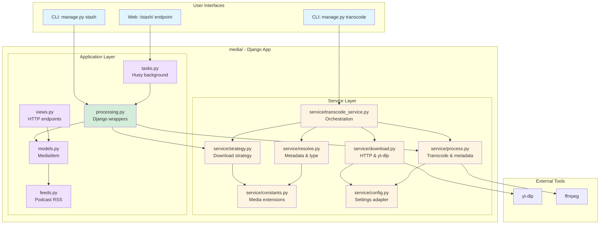
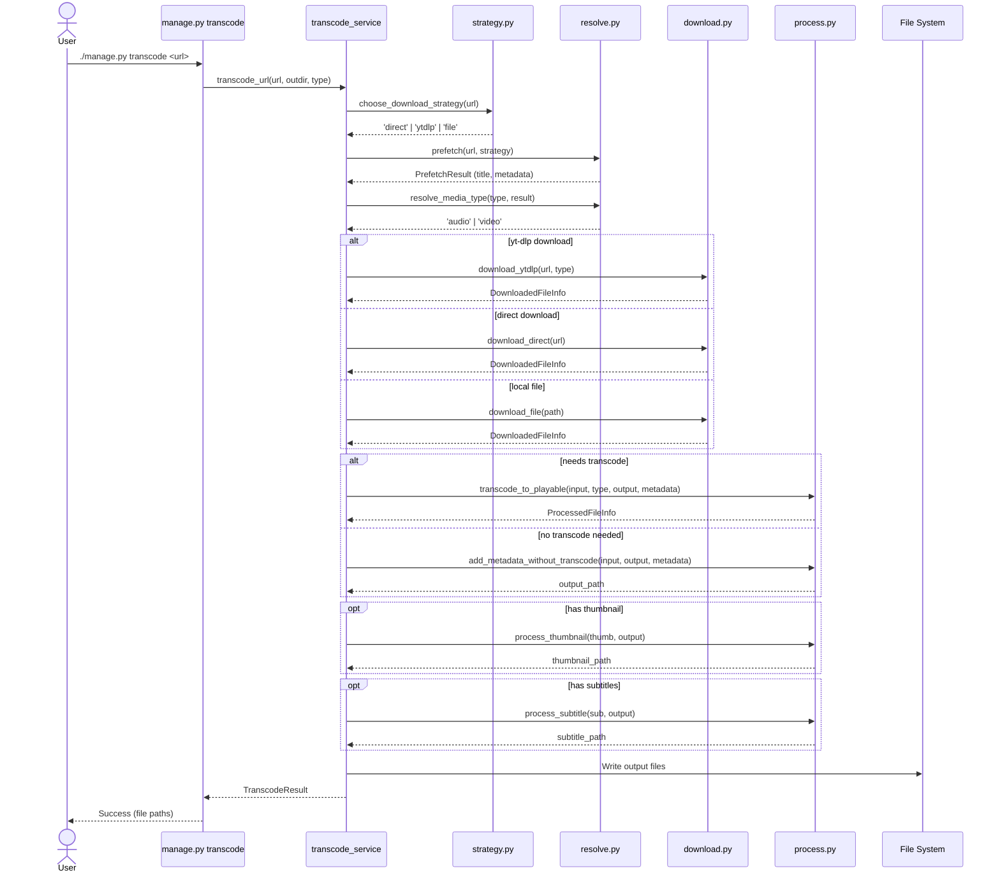
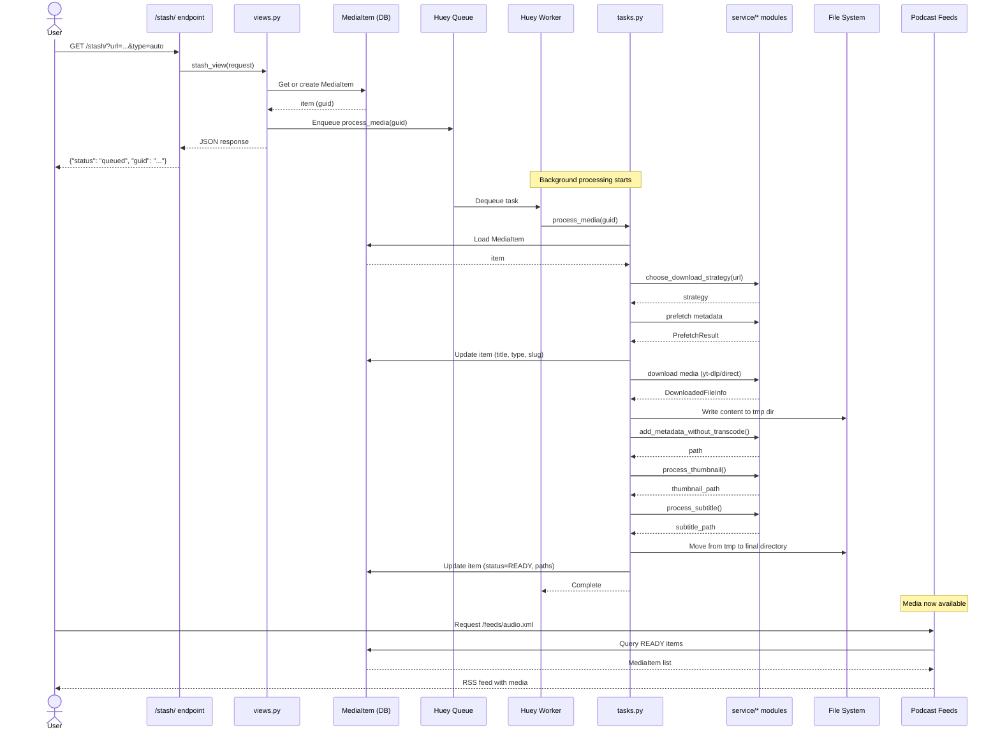
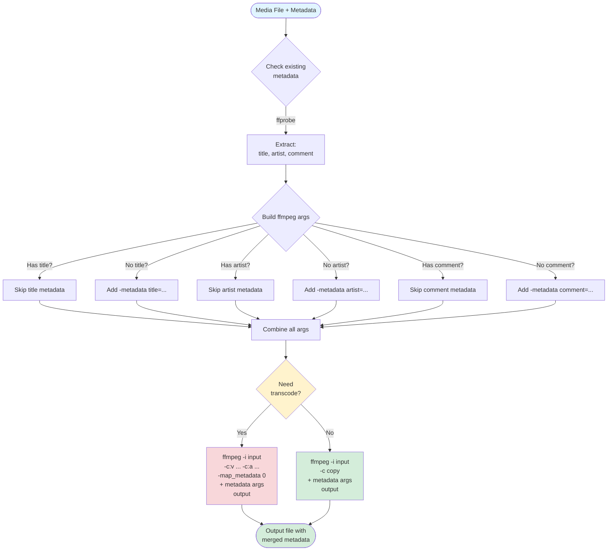

# Architecture

This document describes the internal architecture of STASHCAST, particularly the service layer that provides shared functionality between the CLI and web app.

## Overview

STASHCAST is organized into two main layers within the Django `media` app:

1. **Service Layer** (`media/service/`) - Reusable media processing functions
2. **Application Layer** (`media/`) - Django models, views, tasks, CLI commands, and processing wrappers

This separation allows:
- Service functions to be pure, testable, and reusable
- Processing wrappers to bridge service functions with Django models
- Clear separation between background tasks (Huey) and foreground execution (CLI)



## Directory Structure

```
stashcast/
├── media/                      # Main Django app
│   ├── service/               # Reusable service functions
│   │   ├── constants.py       # Media extensions
│   │   ├── strategy.py        # Download strategy detection
│   │   ├── resolve.py         # Metadata extraction
│   │   ├── download.py        # Download implementations
│   │   ├── process.py         # Media processing (transcode, metadata)
│   │   ├── config.py          # Settings adapter
│   │   └── transcode_service.py  # Transcode orchestration
│   │
│   ├── processing.py          # Django wrappers for service functions
│   ├── models.py              # MediaItem model
│   ├── views.py               # HTTP endpoints (/stash/, /items/)
│   ├── feeds.py               # Podcast feed generation
│   ├── tasks.py               # Huey background tasks
│   ├── admin.py               # Django admin interface
│   ├── management/commands/   # CLI commands
│   │   ├── stash.py          # Foreground stash command
│   │   ├── transcode.py      # Standalone transcode command
│   │   └── summarize.py      # Subtitle summarization
│   ├── tests.py               # App integration tests (44 tests)
│   └── test_service/          # Service layer tests (121 tests)
│
└── stashcast/                  # Django project settings
    └── settings.py
```

## Service Layer Components

### `media/service/constants.py`

Centralized media format definitions:

- `MEDIA_EXTENSIONS` - All supported formats (`.mp3`, `.mp4`, etc.)
- `AUDIO_EXTENSIONS` - Audio-only formats
- `VIDEO_EXTENSIONS` - Video-only formats

**Used by**: `strategy.py`, `resolve.py`

### `media/service/strategy.py`

Download strategy detection:

```python
def choose_download_strategy(url) -> str:
    """Returns 'file', 'direct', or 'ytdlp'"""
```

Determines whether to:
- Copy a local file (`file`)
- Download via HTTP (`direct`)
- Use yt-dlp for extraction (`ytdlp`)

**Used by**: CLI transcode command, web app tasks

### `media/service/resolve.py`

Metadata extraction and media type resolution:

```python
def prefetch(url, strategy, logger=None) -> PrefetchResult:
    """Extract metadata without downloading"""

def resolve_media_type(requested_type, prefetch_result) -> str:
    """Determine 'audio' or 'video' from metadata"""
```

**Used by**: CLI transcode command, web app prefetch tasks

### `media/service/media_info.py`

Centralized media helpers:

```python
def get_media_type_from_extension(extension) -> str:
    """Determine media type from file extension"""

def get_streams_from_extension(extension) -> tuple[bool, bool]:
    """Infer audio/video presence from file extension"""

def extract_ffprobe_metadata(file_path) -> dict:
    """Parse ffprobe metadata (duration, tags)"""
```

**Used by**: resolve, processing, transcode service

### `media/service/download.py`

Download implementations:

```python
def download_file(file_path, out_path, logger=None) -> DownloadedFileInfo:
    """Copy local file"""

def download_direct(url, out_path, logger=None) -> DownloadedFileInfo:
    """Download via HTTP"""

def download_ytdlp(url, resolved_type, temp_dir, ytdlp_extra_args='', logger=None) -> DownloadedFileInfo:
    """Download using yt-dlp"""
```

All return `DownloadedFileInfo` dataclass with paths to content, thumbnail, and subtitles.

**Used by**: CLI transcode command

### `media/service/process.py`

Media processing (transcoding, metadata embedding):

```python
def needs_transcode(file_path, resolved_type) -> bool:
    """Check if file needs transcoding"""

def transcode_to_playable(input_path, resolved_type, output_path,
                          ffmpeg_extra_args='', metadata=None, logger=None) -> ProcessedFileInfo:
    """Transcode media to compatible format with metadata"""

def add_metadata_without_transcode(input_path, output_path,
                                   metadata=None, logger=None) -> Path:
    """Add metadata without re-encoding (stream copy)"""

def process_thumbnail(thumbnail_path, output_path, logger=None) -> Path:
    """Convert thumbnail to WebP"""

def process_subtitle(subtitle_path, output_path, logger=None) -> Path:
    """Convert subtitle to VTT"""
```

**Key features**:
- Preserves existing metadata from source files
- Only adds metadata if source doesn't already have it
- Falls back to simple file copy if ffmpeg fails
- Used by both CLI and web app for consistent processing

**Used by**: CLI transcode command, web app processing tasks

### `media/service/config.py`

Configuration adapter that centralizes access to Django settings:

```python
def get_ytdlp_args_for_type(media_type) -> str:
    """Get yt-dlp arguments from settings"""

def get_ffmpeg_args_for_type(media_type) -> str:
    """Get ffmpeg arguments from settings"""

def parse_ytdlp_extra_args(args_string, base_opts) -> dict:
    """Parse yt-dlp CLI args into options dict"""

def get_target_audio_format() -> str:
    """Returns '.m4a'"""

def get_target_video_format() -> str:
    """Returns '.mp4'"""
```

**Used by**: All service modules that need configuration

### `media/service/transcode_service.py`

Main orchestration for the CLI transcode command:

```python
def transcode_url(url, outdir, requested_type='auto',
                  dry_run=False, verbose=False) -> TranscodeResult:
    """Complete pipeline: detect → prefetch → download → process"""
```

Coordinates all service modules to:
1. Detect download strategy
2. Prefetch metadata
3. Resolve media type
4. Download media
5. Transcode if needed
6. Process thumbnails/subtitles
7. Embed metadata

**Used by**: CLI transcode command

## Processing Layer

### `media/processing.py`

Django-specific processing functions shared by both Huey tasks and CLI commands:

```python
def write_log(log_path, message):
    """Append timestamped message to log file"""

def prefetch_direct(item, tmp_dir, log_path):
    """Prefetch metadata for direct URL - updates MediaItem"""

def prefetch_file(item, tmp_dir, log_path):
    """Prefetch metadata for local file path - updates MediaItem"""

def prefetch_ytdlp(item, tmp_dir, log_path):
    """Prefetch metadata using yt-dlp - updates MediaItem"""

def extract_metadata_with_ffprobe(item, file_path, log_path):
    """Extract metadata from media file using ffprobe"""

def download_direct(item, tmp_dir, log_path):
    """Download media directly via HTTP"""

def download_ytdlp(item, tmp_dir, log_path):
    """Download media using yt-dlp"""

def process_files(item, tmp_dir, log_path):
    """Process downloaded files (metadata, thumbnails, subtitles)"""
```

**Key features**:
- All functions work with Django MediaItem model
- All functions write to log files
- All functions save to tmp directories
- Uses service layer functions for actual media operations
- Shared by both `tasks.py` (Huey) and `management/commands/stash.py` (CLI)

**Used by**: Huey tasks, CLI stash command

## Application Layer

### `media/tasks.py`

Huey background tasks for the web application:

```python
@db_task()
def process_media(guid):
    """Main processing task"""
    # 1. PREFETCHING - calls prefetch_direct(), prefetch_file(), or prefetch_ytdlp()
    # 2. DOWNLOADING - calls download_direct() or download_ytdlp()
    # 3. PROCESSING - calls process_files()
    # 4. READY - moves from tmp to final directory

@db_task()
def generate_summary(guid):
    """Generate summary from subtitles"""
```

**Key implementation**:
- Imports processing functions from `media.processing`
- Manages MediaItem state transitions (PREFETCHING → DOWNLOADING → PROCESSING → READY)
- Handles tmp directory creation and cleanup
- Moves files from tmp directory to final slug-based directory

### `media/management/commands/stash.py`

CLI command for foreground stashing (no Huey):

```python
./manage.py stash <url> [--type auto|audio|video] [--verbose] [--json]
```

**Features**:
- Same pipeline as web app but runs synchronously
- Reuses existing MediaItem or creates new one
- Overwrites files if URL already exists
- Supports `--verbose` for detailed logging
- Supports `--json` for machine-readable output
- Detects and rejects playlist URLs
- Uses same processing functions as Huey tasks

**Used by**: CLI workflows, debugging, automation scripts

### `media/models.py`

Django model representing a media item with all metadata and file paths.

### `media/views.py`

HTTP endpoints:
- `/stash/` - API endpoint to queue downloads
- `/items/<guid>/` - Episode detail pages

### `media/feeds.py`

Podcast feed generation using Django's syndication framework.

### `media/admin.py`

Django admin interface with custom actions for re-fetching and regenerating summaries.

## Data Flow

### CLI Transcode Command



### Web App Stash Endpoint



## Design Principles

### 1. Single Source of Truth

- **Constants**: All media extensions in `media/service/constants.py`
- **Strategy**: URL detection logic in `media/service/strategy.py`
- **Processing**: Metadata/transcode logic in `media/service/process.py`

### 2. Separation of Concerns

- **Service layer**: Pure Python, framework-agnostic, returns dataclasses
- **Web layer**: Django-specific, updates models, manages task queue

### 3. Consistent Behavior

Both CLI and web app:
- Use same download logic
- Use same metadata embedding
- Use same thumbnail/subtitle processing
- Get same configuration from Django settings

### 4. Testability

- **Service layer**: 121 tests, no Django dependencies
- **Web layer**: 42 tests for Django-specific features
- Total: 163 tests, all passing

## Configuration

All configuration is centralized in Django settings (via environment variables):

```python
# Required
STASHCAST_DATA_DIR = '/path/to/data'
STASHCAST_MEDIA_DIR = STASHCAST_DATA_DIR / 'media'
STASHCAST_USER_TOKEN = 'verysecret'

# Optional
STASHCAST_DEFAULT_YTDLP_ARGS_AUDIO = '--format bestaudio'
STASHCAST_DEFAULT_YTDLP_ARGS_VIDEO = '--format "bv*[height<=720]"'
STASHCAST_DEFAULT_FFMPEG_ARGS_AUDIO = '-c:a aac -b:a 128k'
STASHCAST_DEFAULT_FFMPEG_ARGS_VIDEO = '-c:v libx264 -preset medium'
```

Both CLI and web app read configuration through `service/config.py`.

## Metadata Handling

### Metadata Preservation

The service layer preserves existing metadata from source files:

1. Extract existing metadata with `get_existing_metadata()`
2. Only add new metadata if source doesn't have it
3. Use `-map_metadata 0` to copy all existing tags
4. Prefer source metadata over yt-dlp metadata

This ensures:
- Original artist/album info is preserved
- Only missing metadata is filled in
- No metadata is lost during processing



### Metadata Embedding Methods

**With transcoding** (`transcode_to_playable`):
- Re-encodes media to target format
- Embeds metadata during transcode
- Used when format conversion needed

**Without transcoding** (`add_metadata_without_transcode`):
- Uses `ffmpeg -c copy` for stream copy
- No quality loss
- Faster than transcoding
- Used when format is already compatible

## Output Directory Structure

### Web App Output

Files are organized by slug under the unified media directory:

```
/media/<slug>/
  content.m4a OR content.mp3 OR content.mp4
  thumbnail.webp (if available)
  subtitles.vtt (if available)
```

### CLI Output

The transcode command outputs files directly:

```
/output-dir/
  <slug>.mp3 OR <slug>.mp4
```

## Media Processing Behavior

### Overwrite Behavior

When fetching the same URL again:

- Reuses the same database row
- Reuses the same slug and GUID
- Overwrites files on disk
- Appends a log entry noting the overwrite

### Summary Generation

Summaries are generated from downloaded subtitles using extractive summarization (LexRank):

- Automatically generated during download if subtitles are available
- Can be regenerated from admin interface
- Future-ready for audio transcription-based summaries

## Future Enhancements

The architecture is designed to support:

1. **Alternative backends**: Service layer could be adapted for cloud storage
2. **Batch processing**: Service functions are stateless and reusable
3. **Alternative frontends**: Service layer could power API, CLI, or GUI
4. **ML-based summaries**: Service layer has hooks for future transcription/summarization

## Development

### Running Tests

```bash
# All tests
pytest

# Service layer only
pytest media/test_service/

# App integration tests only
pytest media/tests/

# Parallel execution for faster results (requires pytest-xdist)
pytest -n auto
```

### Adding New Features

**For reusable media processing functions:**
1. Add to appropriate `media/service/` module
2. Add tests to `media/test_service/`
3. Keep functions pure (no Django model dependencies)
3. Update both CLI command and web tasks to use it

**For web-only features:**
1. Add to `media/` directory
2. Add tests to `media/tests/`
3. No service layer changes needed

## Summary

The service layer refactoring eliminated code duplication and created a clean separation between:

- **What to do** (service layer - media processing logic)
- **When to do it** (web layer - task scheduling, user interaction)

This makes the codebase easier to maintain, test, and extend.
